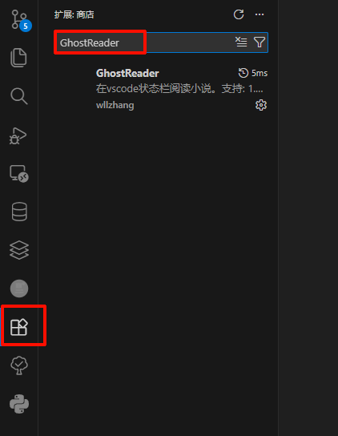
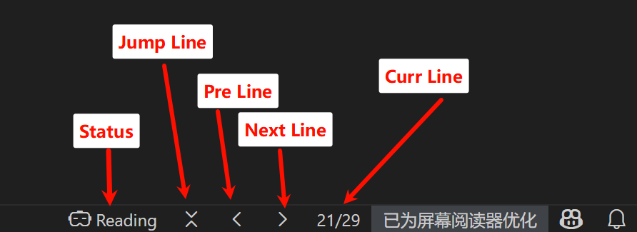
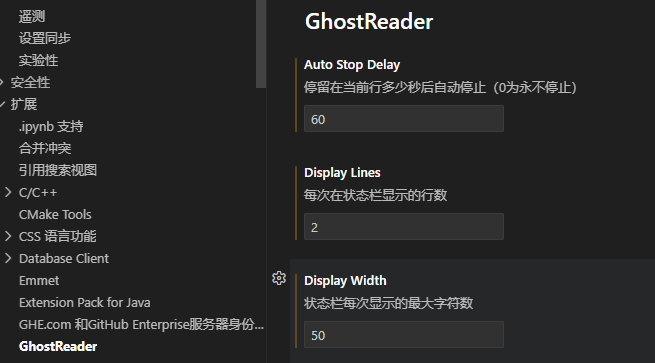

# GhostReader

一个让你在 VSCode 状态栏优雅阅读小说的MO神器 📖

## ✨ 特性

- 📖 **状态栏阅读** - 在 VSCode 状态栏直接阅读 txt 小说
- ⌨️ **快捷键翻页** - 支持 Ctrl+Left/Right（Windows）或 Cmd+Left/Right（Mac）快捷键
- 📚 **书架管理** - 轻松导入、删除和管理你的书籍
- 🔄 **模式切换** - Reading/Coding 模式随时切换，避免快捷键冲突
- 💾 **进度保存** - 自动保存阅读进度，下次打开继续阅读
- ⏭️ **快速跳转** - 跳转到指定页码继续阅读
- 🎨 **优雅设计** - 简洁的界面，不打扰你的工作流
- ⚙️ **自定义配置** - 可配置显示行数和自动停止时间
- ⏰ **自动停止** - 支持设置无操作后自动隐藏阅读内容

## 📦 快速开始

### 安装

1. 打开 VSCode
2. 按 `Ctrl+P` / `Cmd+P`，输入 `ext install wllzhang.GhostReader`
3. 或在扩展面板搜索 "GhostReader"

### 使用

1. 点击侧边栏的 Ghost READER 图标
2. 点击 `+` 按钮导入 txt 书籍
3. 点击书籍开始阅读
4. 使用 `Ctrl+Left/Right` 翻页（Mac: `Cmd+Left/Right`）

> **注意**: 需要先切换到 **Reading mode** 才能使用快捷键！

## 🚀 详细使用

### 界面预览

### 快捷键

| 操作   | Windows      | Mac         |
| ------ | ------------ | ----------- |
| 上一页 | `Ctrl+Left`  | `Cmd+Left`  |
| 下一页 | `Ctrl+Right` | `Cmd+Right` |

> ⚠️ **重要**: 需要先切换到 **Reading mode** 才能使用快捷键！

### 模式切换

- **📖 Reading mode** - 启用阅读快捷键
- **💻 Coding mode** - 禁用阅读快捷键（默认，停止阅读后自动切换）

## 🎯 常用操作

| 操作     | 说明                             |
| -------- | -------------------------------- |
| 导入书籍 | 点击侧边栏的 `+` 按钮            |
| 删除书籍 | 右键点击书架中的书籍             |
| 跳转页码 | 点击状态栏的跳转按钮             |
| 模式切换 | 点击状态栏的 Reading/Coding 按钮 |

## ⚙️ 配置选项

在 VSCode 设置中搜索 "GhostReader" 可配置：

| 配置项                      | 说明               | 默认值 | 范围     |
| --------------------------- | ------------------ | ------ | -------- |
| `ghostReader.displayLines`  | 状态栏显示的行数   | 1      | 1-10     |
| `ghostReader.autoStopDelay` | 自动停止延迟（秒） | 0      | 0 或正数 |

> 💡 设置 `autoStopDelay` 为 30 表示 30 秒无操作后自动隐藏阅读内容

## 📝 支持格式

目前仅支持 `.txt` 格式的文本文件，建议使用 UTF-8 编码以获得最佳体验。

## 🤝 参与贡献

欢迎贡献代码、报告问题或提出建议！查看 [贡献指南](.github/CONTRIBUTING.md) 了解详情。

## 📖 文档与支持

- 📚 [完整文档](https://wllzhang.github.io/GhostReader/) - 详细使用指南和 API 文档
- 🐛 [报告问题](https://github.com/wllzhang/GhostReader/issues) - Bug 报告和功能建议
- 💬 [获取帮助](.github/SUPPORT.md) - 常见问题和支持渠道
- 🔒 [安全政策](.github/SECURITY.md) - 安全漏洞报告流程
- 📜 [行为准则](.github/CODE_OF_CONDUCT.md) - 社区行为规范

## 📄 许可证

[MIT License](LICENSE)

---

如果这个项目对你有帮助，请给个 ⭐ Star 支持一下！

**让 VS Code 成为你的秘密阅读角落** 👻📖

