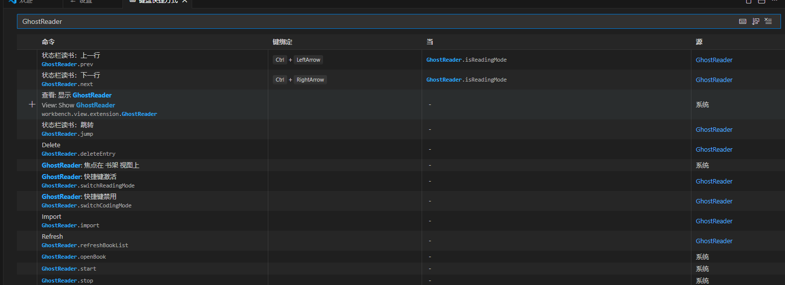

# GhostReader

<div align="center">

一个让你在 VSCode 状态栏优雅阅读小说的摸鱼神器 📖

[](https://marketplace.visualstudio.com/items?itemName=wllzhang.GhostReader)
[](https://marketplace.visualstudio.com/items?itemName=wllzhang.GhostReader)
[](https://github.com/wllzhang/GhostReader/blob/main/LICENSE)

</div>

## ✨ 特性

- 📖 **状态栏阅读** - 在 VSCode 状态栏直接阅读 txt 小说
- ⌨️ **快捷键翻页** - 支持 Ctrl+Left/Right（Windows）或 Cmd+Left/Right（Mac）快捷键
- 📚 **书架管理** - 轻松导入、删除和管理你的书籍
- 🔄 **模式切换** - Reading/Coding 模式随时切换，避免快捷键冲突
- 💾 **进度保存** - 自动保存阅读进度，下次打开继续阅读
- ⏭️ **快速跳转** - 跳转到指定页码继续阅读
- 🎨 **优雅设计** - 简洁的界面，不打扰你的工作流
- ⚙️ **自定义配置** - 可配置显示行数和自动停止时间
- ⏰ **自动停止** - 支持设置无操作后自动隐藏阅读内容

## 📦 安装

### 从 VSCode 市场安装

1. 打开 VSCode
2. 按 `Ctrl+P` / `Cmd+P`
3. 输入 `ext install wllzhang.GhostReader`
4. 或在扩展面板搜索 "GhostReader"

### 从 VSIX 安装

```bash
code --install-extension GhostReader-2.0.0.vsix
```

## 🚀 使用指南

### 1. 导入书籍

1. 安装成功后，侧边栏会显示插件图标, 点击 `+` 按钮导入 txt 书籍, 点击书架中的书籍开始阅读：


### 2. 快捷键

| 操作   | Windows      | Mac         |
| ------ | ------------ | ----------- |
| 上一页 | `Ctrl+Left`  | `Cmd+Left`  |
| 下一页 | `Ctrl+Right` | `Cmd+Right` |

**注意**: 需要先切换到 **Reading mode** 才能使用快捷键！



### 3. 状态栏

状态栏有两个模式按钮：

- **📖 Reading mode** - 启用阅读快捷键
- **💻 Coding mode** - 禁用阅读快捷键（默认）


停止阅读后会自动切换回 `Coding` 模式，避免影响编码工作。

## 🎯 功能说明

- **导入书籍**: 点击侧边栏的 `+` 按钮
- **删除书籍**: 在书架中右键点击书籍
- **刷新书架**: 点击刷新按钮同步书籍列表
- **跳转页码**: 点击状态栏的跳转按钮
- **开始/停止**: 使用状态栏的播放/停止按钮

## ⚙️ 配置选项

GhostReader 支持以下配置项（在 VSCode 设置中搜索 "GhostReader"）：


### 显示行数 (`ghostReader.displayLines`)

设置每次在状态栏显示的行数。

- **默认值**: 1
- **取值范围**: 1-10
- **使用场景**: 如果希望一次看到更多内容，可以增加这个值

### 自动停止延迟 (`ghostReader.autoStopDelay`)

设置停留在当前行多少秒后自动停止阅读。

- **默认值**: 0（永不自动停止）
- **取值范围**: 0 或任意正数（单位：秒）
- **使用场景**: 设置为 30 表示 30 秒内无操作则自动隐藏阅读内容

**配置示例**:

```json
{
  "ghostReader.displayLines": 3,
  "ghostReader.autoStopDelay": 30
}
```

## 📝 支持格式

目前仅支持 `.txt` 格式的文本文件。

建议使用 UTF-8 编码的 txt 文件以获得最佳体验。

## 🛠️ 开发指南

### 环境要求

- Node.js >= 20.x
- VSCode >= 1.95.0

### 本地开发

```bash
# 克隆仓库
git clone https://github.com/wllzhang/GhostReader.git
cd GhostReader

# 安装依赖
npm install

# 编译
npm run compile

# 监听模式
npm run watch

# 构建生产版本
npm run build
```

### 调试

1. 按 `F5` 启动调试
2. 在新窗口测试扩展功能
3. 使用 `Developer: Reload Window` 重载

### 代码规范

```bash
# 格式化代码
npm run format

# 运行 linter
npm run lint

# 类型检查
npm run compile
```

### 打包发布

```bash
# 打包 VSIX
npm run package

# 发布到市场
npm run publish
```

## 🏗️ 技术栈

- **开发语言**: TypeScript 5.7
- **构建工具**: esbuild
- **代码规范**: ESLint + Prettier
- **VSCode API**: ^1.95.0

## 📄 许可证

[MIT License](LICENSE)

## 🤝 贡献

欢迎贡献代码、报告问题或提出建议！

1. Fork 本仓库
2. 创建特性分支 (`git checkout -b feature/AmazingFeature`)
3. 提交更改 (`git commit -m 'Add some AmazingFeature'`)
4. 推送到分支 (`git push origin feature/AmazingFeature`)
5. 开启 Pull Request

## 💡 灵感来源

灵感来自工作中偶尔的摸鱼时光 😄

## 🙏 致谢

感谢所有贡献者和使用者的支持！

---

<div align="center">

如果这个项目对你有帮助，请给个 ⭐ Star 支持一下！

[报告问题](https://github.com/wllzhang/GhostReader/issues) · [功能建议](https://github.com/wllzhang/GhostReader/issues)

</div>
