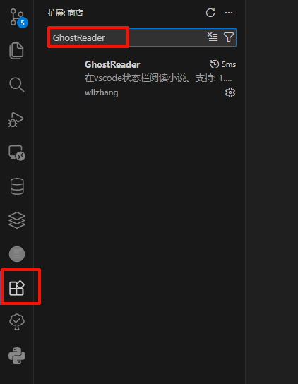
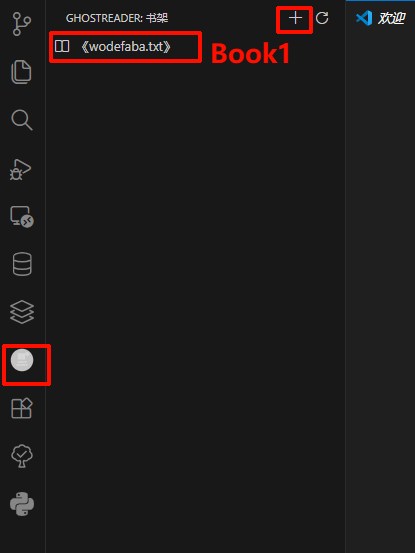
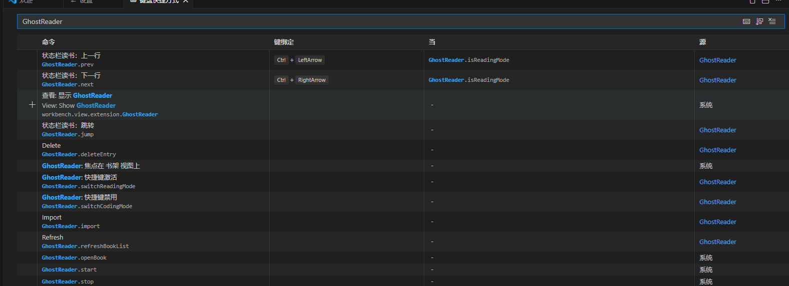
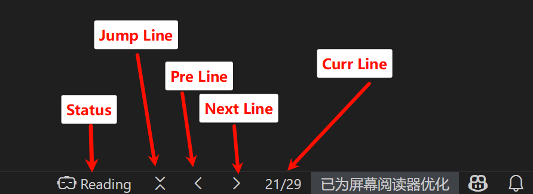
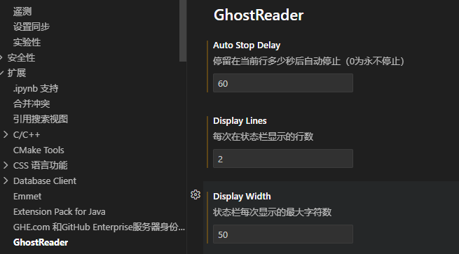

# GhostReader

English | **[简体中文](README.zh-CN.md)**

Read comfortably in the VS Code status bar 📖

## Features

- **Status bar reading** — Read `.txt` files directly in the VS Code status bar
- **Keyboard navigation** — `Ctrl+Left` / `Ctrl+Right` on Windows, `Cmd+Left` / `Cmd+Right` on macOS
- **Library management** — Import, delete, and organize your text files
- **Reading / Coding modes** — Switch modes to avoid shortcut conflicts while coding
- **Progress** — Reading position is saved automatically
- **Jump to page** — Go to a specific page from the status bar
- **Clean UI** — Minimal interface that stays out of your way
- **Settings** — Configure visible lines and auto-hide delay
- **Auto stop** — Optionally hide reading content after idle time

## Quick start

### Install

1. Open VS Code
2. Press `Ctrl+P` / `Cmd+P`, run `ext install wllzhang.GhostReader`
3. Or search for **GhostReader** in the Extensions view

### Usage

1. Open the Ghost READER icon in the activity bar
2. Click **+** to import a `.txt` file
3. Click a book to switch to **Reading mode** and start reading
4. Use `Ctrl+Left` / `Ctrl+Right` (Mac: `Cmd+Left` / `Cmd+Right`) to turn pages
5. Click **Coding** in the status bar to stop reading and hide content

> **Note:** **Reading mode** starts reading and shows content; **Coding mode** stops reading.

## Details

### UI preview

### Shortcuts

| Action      | Windows       | Mac          |
| ----------- | ------------- | ------------ |
| Previous    | `Ctrl+Left`   | `Cmd+Left`   |
| Next        | `Ctrl+Right`  | `Cmd+Right`  |

> **Important:** Shortcuts work only in **Reading mode**.

### Modes

- **Reading mode** — Enables reading shortcuts, shows content
- **Coding mode** — Disables reading shortcuts, hides content

> Changing mode controls both reading state and shortcuts; there is no separate start/stop control.

## Common tasks

| Task        | How |
| ----------- | --- |
| Import      | Click **+** in the sidebar |
| Delete      | Right-click an item in the reading list |
| Jump        | Use the jump control in the status bar |
| Switch mode | Click **Reading** / **Coding** in the status bar |

## Settings

Search for **GhostReader** in VS Code Settings:

| Setting                     | Description                          | Default | Range        |
| --------------------------- | ------------------------------------ | ------- | ------------ |
| `ghostReader.displayLines`  | Lines shown in the status bar        | 1       | 1–10         |
| `ghostReader.displayWidth`  | Max characters per “page” in bar   | 45      | 10–200       |
| `ghostReader.autoStopDelay` | Auto-hide after idle (seconds)       | 0       | 0 = disabled |

> **Paging:** If a line exceeds `displayWidth`, it is split into virtual pages; next/prev moves within the line before the next line.
>
> Example: `autoStopDelay` set to `30` hides reading content after 30 seconds of no navigation.

## Supported formats

Only `.txt` files are supported. UTF-8 is recommended.

## Contributing

Issues and pull requests are welcome. See [CONTRIBUTING](.github/CONTRIBUTING.md).

## Docs and support

- [Full documentation](https://wllzhang.github.io/GhostReader/) — Guides and API
- [Issues](https://github.com/wllzhang/GhostReader/issues) — Bugs and feature requests
- [Support](.github/SUPPORT.md) — Help and FAQ
- [Security](.github/SECURITY.md) — Reporting vulnerabilities
- [Code of conduct](.github/CODE_OF_CONDUCT.md)

## License

[MIT License](LICENSE)

---

If this project helps you, consider giving it a star ⭐

**Turn VS Code into your reading space** 👻📖

